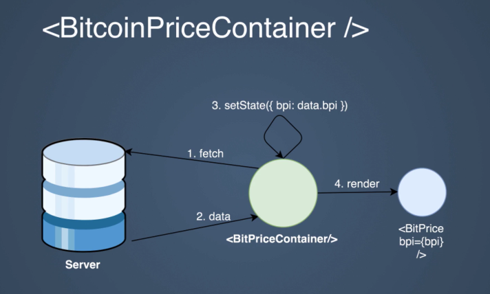

# Aprender React JS

<!-- TOC depthfrom:2 depthto:3 orderedlist:false -->

- [Introducción del curso](#introducci%C3%B3n-del-curso)
- [Configuracion del entorno](#configuracion-del-entorno)
    - [Linter](#linter)
- [Conceptos basicos](#conceptos-basicos)
    - [Introducción sobre los conceptos básicos de React](#introducci%C3%B3n-sobre-los-conceptos-b%C3%A1sicos-de-react)
    - [Introdución a JSX](#introduci%C3%B3n-a-jsx)
    - [Componentes en ReactJS](#componentes-en-reactjs)
    - [Entendiendo las props](#entendiendo-las-props)
    - [Funciones y elementos como props](#funciones-y-elementos-como-props)
    - [Inmutabilidad de las props](#inmutabilidad-de-las-props)
    - [Props por defecto](#props-por-defecto)
    - [Gestion del estado en ReactJS](#gestion-del-estado-en-reactjs)
    - [Actualizar estado mediante setState()](#actualizar-estado-mediante-setstate)
    - [Propagación del estado](#propagaci%C3%B3n-del-estado)
    - [Inicialización del estado mediante Props](#inicializaci%C3%B3n-del-estado-mediante-props)
- [Renderizado condicional y listas](#renderizado-condicional-y-listas)
    - [Condicionales en el método Render](#condicionales-en-el-m%C3%A9todo-render)
    - [Utilizando ternarias](#utilizando-ternarias)
    - [Trabajando con listas](#trabajando-con-listas)
    - [Listas de objetos](#listas-de-objetos)
- [React Developer Tools](#react-developer-tools)
- [Eventos y Formularios](#eventos-y-formularios)
    - [El evento onClick](#el-evento-onclick)
    - [Eventos sintéticos](#eventos-sint%C3%A9ticos)
    - [Eventos sportados](#eventos-sportados)
    - [Formularios en React](#formularios-en-react)
    - [Particularidades del atributo For](#particularidades-del-atributo-for)
    - [Entendiendo las Refs](#entendiendo-las-refs)
    - [El evento onSubmit](#el-evento-onsubmit)
    - [Componentes controlados](#componentes-controlados)
- [Children y PropTypes](#children-y-proptypes)
    - [La prop especial Children](#la-prop-especial-children)
    - [Children Layout](#children-layout)
    - [Desarrollando con PropTypes](#desarrollando-con-proptypes)
- [Ciclo de Vida de los Componentes](#ciclo-de-vida-de-los-componentes)
    - [Fases](#fases)
    - [El Constructor](#el-constructor)
    - [ComponentwillMount](#componentwillmount)
    - [Render](#render)
    - [ComponentDidMount](#componentdidmount)
    - [Fetch API](#fetch-api)
- [Ciclo de actualización](#ciclo-de-actualizaci%C3%B3n)
    - [ComponentWillReceiveProps](#componentwillreceiveprops)
    - [Refactor de ComponentWillReceiveProps](#refactor-de-componentwillreceiveprops)
    - [ShouldComponentUpdate](#shouldcomponentupdate)
    - [ShouldComponentUpdate con PureComponent](#shouldcomponentupdate-con-purecomponent)
    - [ComponentWillUpdate](#componentwillupdate)
    - [ComponentDidUpdate](#componentdidupdate)
- [Ciclo de desmontaje](#ciclo-de-desmontaje)
    - [ComponentDidUnmount](#componentdidunmount)
- [Ciclo de Error](#ciclo-de-error)
    - [ComponentDidCatch](#componentdidcatch)
- [Buenas Prácticas](#buenas-pr%C3%A1cticas)
    - [Composición vs herencia](#composici%C3%B3n-vs-herencia)
    - [Componentes funcionales puros (Stateless components)](#componentes-funcionales-puros-stateless-components)
    - [PropTypes en stateles components](#proptypes-en-stateles-components)
    - [Patrón contenedor contenido](#patr%C3%B3n-contenedor-contenido)
    - [Componente Strict Mode](#componente-strict-mode)
- [PROYECTO - Buscador de peliculas online](#proyecto---buscador-de-peliculas-online)
    - [Preparando el entorno de nuestra aplicación](#preparando-el-entorno-de-nuestra-aplicaci%C3%B3n)
    - [Creando el componente SearchFrom](#creando-el-componente-searchfrom)
    - [Usando Fetch para obtener resultados de busqueda desde una API](#usando-fetch-para-obtener-resultados-de-busqueda-desde-una-api)
    - [Creando componentes reutilizables y mejorando el layout](#creando-componentes-reutilizables-y-mejorando-el-layout)
    - [Mejoras en la implementación de búsqueda](#mejoras-en-la-implementaci%C3%B3n-de-b%C3%BAsqueda)
    - [Introducción al enruado en React](#introducci%C3%B3n-al-enruado-en-react)
    - [Enrutado básico](#enrutado-b%C3%A1sico)
    - [Separando la página Home](#separando-la-p%C3%A1gina-home)
    - [Creando una SPA con React Router](#creando-una-spa-con-react-router)
    - [Página 404](#p%C3%A1gina-404)
    - [Publicando con Surge](#publicando-con-surge)
- [Redux, gestionando el estado global de tu aplicación](#redux-gestionando-el-estado-global-de-tu-aplicaci%C3%B3n)
- [Proyectos de los estudiantes](#proyectos-de-los-estudiantes)

<!-- /TOC -->

## Introducción del curso
https://www.udemy.com/course/aprendiendo-react/

## Configuracion del entorno
* Install
  * NodeJS
  * Visual Studio Code
  * Create React App

* Create test app
https://create-react-app.dev/
```shell
$>npx create-react-app my-app  
$>npm start
```
* app.js
```js
import React from 'react';
import logo from './logo.svg';
import './App.css';
function App() {
  return (
    <div className="App">
      <header className="App-header">
        
        <p>
          Edit <code>src/App.js</code> and save to reload.
        </p>
        <a
          className="App-link"
          href="https://reactjs.org"
          target="_blank"
          rel="noopener noreferrer"
        >
          Learn React
        </a>
      </header>
    </div>
  );
}
export default App;
```

### Linter
* Instalar plugin eslint
* Crear el fichero **.eslintrc**
```json
{
    "extends": "react-app"
}
```

## Conceptos basicos

### Introducción sobre los conceptos básicos de React
* Declarativo: indicamos qué y como.
* Basado en componentes:
  * Partes mas pequeñas de la interfaz.
  * Cada componente encapsula su estado.
  * Codigo mas reusable, mantenible y pequeño.
* Programación reactiva: cambio de estado renderiza el componente.
* Virtual DOM: genera una copia del árbol de elementos del navegador para solo hacer los mínimos cambios necesarions para reglejar el estado de nuestros componentes.
* Eventos sintéticos:
  * Abstraciond de los eventos nativos de los navegadores
  * Compatibilidad cross browsing sin necesidad de más librerías.
  * Soporte para todos los eventos 1ue puedas necesitar desde click y double click, hasta eventos móviles como touchstaert y touchend.
* Server Side Rendering: el mismo codigo que se renderiza en el cliente lo tenemos en el servidor.

### Introdución a JSX
Es una sintaxis para generar componentes en React
https://babeljs.io/repl
  

#### Ejemplo 01
```jsx
const element = <h1>Hello, world</h1>
```
Se convierte en:
```js
var element = React.createElement("h1", null, "Hello, world");
```

#### Ejemplo 02: expresion
```jsx
const element = <h1>{2 + 2}</h1>
```
Se convierte en:
```js
var element = React.createElement("h1", null, 2 + 2);
```

#### Ejemplo 03: funciones
```jsx
function multiplicar(a,b) { return a * b }
const mostrar = true
const element = <h1>{mostrar ? multiplicar(2,3) : "nada que mostrar"}</h1>
```
Se convierte en:
```js
function multiplicar(a, b) {
  return a * b;
}
var mostrar = true;
var element = React.createElement("h1", null, mostrar ? multiplicar(2, 3) : "nada que mostrar");
```

#### Ejemplo 04: atributos
```jsx
const image = 
```
Se convierte en:
```js
var image = React.createElement("img", { src: "http://aaa/image.jpg" });
```

#### Ejemplo 05: two elements
```jsx
const element = <div><h1>Hola mundo</h1><h2>subtitulo</h2></div>
```
Se convierte en:
```js
var element = React.createElement("div", null,
  React.createElement("h1", null, "Hola mundo"),
  React.createElement("h2", null, "subtitulo"));
```

### Componentes en ReactJS

#### Componente como Function
```js
function Hello(props) {
  return <h2>{props.title}</h2>
}
```

#### Componente como Arrow Function
```js
const HelloArrow = (props) => <h2>{props.title}</h2>
```

#### Componente como clase que hereda de Component
```js
class HelloComponent extends Component {
  render() {
    return <h2>{this.props.title}</h2>
  }
}
```
* Usando los componentes
```html
function App() {
  return (
    <div className="App">
      <header className="App-header">
        <Hello title="Ole ole ole"/>
        <HelloArrow title="Ole ole ole ARROW"/>
        <HelloComponent title="ole ole ole, COMPONENT!"></HelloComponent>
      </header>
    </div>
  );
}
export default App;
```

### Entendiendo las props
Pasando arrays y objetos como props
```js
class MyComponent extends Component {
  render() {
    const isActivated = this.props.isActivated ? 'on' : 'off'
    const arrayTranform = this.props.arrayOfProps.map(this.props.multiply)
    return (
      <div>
        <span>{this.props.text}</span> &nbsp;
        <span>{this.props.number}</span> &nbsp;
        <span>{isActivated}</span> &nbsp;
        <span>{arrayTranform.join(', ')} </span><br></br>
        <span>nombre: {this.props.person.name} tiene {this.props.person.age}</span>
      </div>
    )
  }
}
```

```js
<MyComponent 
  arrayOfProps={[3,6,9]}
  person={{name:'Atanasio', age:43}}
  isActivated={false}
  multiply={(n) => n * 4}
  number={33} 
  text="Titulo" ></MyComponent>
```

### Funciones y elementos como props

#### Funcion para multiplicar
```js
class MyComponent extends Component {
  render() {
    const arrayTranform = this.props.arrayOfProps.map(this.props.multiply)
    return (
      <div>
        <span>{arrayTranform.join(', ')} </span><br></br>
      </div>
    )
  }
}
```

```js
<MyComponent 
  arrayOfProps={[3,6,9]}
  multiply={(n) => n*4}></MyComponent>
```

#### Patrón deconstruccion
```js
    const {isActivated, arrayOfProps, person, multiply} = this.props
```
 #### Renderizar components dentro de componentes

```js
class MyComponent extends Component {
  render() {
    const {title} = this.props
    return (
      <div>
        {title}
      </div>
    )
  }
}
```

```js
<MyComponent 
  title={<h1>vamos ahi!</h1>}></MyComponent>
```
 

### Inmutabilidad de las props
* No se pueden modificar las propiedades.
* Excepcion cuando se intenta modificar una property 
>TypeError: Assignment to constant variable.


### Props por defecto
```js
class Title extends Component {
  render() {
    return <h3>{this.props.text}</h3>;
  }
}

Title.defaultProps = {
  text: 'titulo x defecto'
}
```


### Gestion del estado en ReactJS
* Ejemplo de componente con estado:
```js
class Contador extends Component {
  constructor() {
    super()
    this.state = { contador: 1}
  }

  render() {
    return <span>{this.state.contador}</span>
  }
}
```

### Actualizar estado mediante setState()
* React es declarativo y reactivo
```js
class Contador extends Component {
  constructor() {
    super()
    this.state = { contador: 1}
    setInterval(() => {
      this.setState({contador: this.state.contador + 1})
    }, 1000)
  }
  render() {
    return <span>{this.state.contador}</span>
  }
}
```

### Propagación del estado
* Cada cambio en el state padre provoca el renderiazado de todos los hijos. 
* El flujo es uniderccional.


### Inicialización del estado mediante Props
```js
class Contador extends Component {
  constructor(props) {
    super(props)
    this.state = { contador: this.props.contadorInitial}
    setInterval(() => {
      this.setState({contador: this.state.contador + 1})
    }, 1000)
  }
```

## Renderizado condicional y listas


### Condicionales en el método Render
```js
import React, {Component} from 'react'

class ComponenteA extends Component {
    render() {
        return <p>componente A</p>
    }
}

class ComponenteB extends Component {
    render() {
        return <p>componente B</p>
    }
}

function userConditional(mostrarA) {
    if (mostrarA) 
        return <ComponenteA/>
    return <ComponenteB/>
}

export default class ConditonalSection extends Component {
    constructor() {
        super()
        this.state = {mostrarA: true}
    }
    render() {
        return (
            <div>
                <h4>Conditional Rendering</h4>
                {userConditional(this.state.mostrarA)}
            </div>
        )
    }
}
```

### Utilizando ternarias
```js
const conditionalComponent = this.state.mostrarA ? <ComponenteA/> : <ComponenteB/>
```

### Trabajando con listas
```js
class Lista extends Component {
  render() {
    const numbers = [1,2,3,4,5]
    return (
      <div>Lista:
        {numbers.map((e, index) => {return <p key={index}>num: {e}</p>})}
      </div>
    )
  }
}
```

### Listas de objetos
* Definir objetos:
```json
[
    {
        "id": "7f9b3b74-8721-11ea-bc55-0242ac130003",
        "name": "CEED",
        "company": "KIA"
    },{
        "id": "1d09517b-a124-4c1f-8a32-f317dd6b368e",
        "name": "CARENS",
        "company": "KIA"
    },{
        "id": "4ef53ef2-88e2-43d7-8c45-f12a9f2010c8",
        "name": "CORSA",
        "company": "OPEL"
    }
]
```

* Definir Componentes
```js
import cars from './data/cars.json'

class CarItem extends Component {
  render() {
    const {car, id} = this.props
    return (
      <li>
        <p>Key: {id}</p>
        <p>Car Company: {car.company}</p>
        <p>Car Name: {car.name}</p>
        <br/>
      </li>
    )
  }
}

class ListaObjetos extends Component {
  render() {
    return (
      <div><h3>Lista Objetos</h3>
        <ul>
          {cars.map(car => {return <CarItem id={car.id} car={car}/>})}
        </ul>
      </div>
    )
  }
}
```


## React Developer Tools
* https://github.com/facebook/react
* https://www.fotocasa.es/es/

## Eventos y Formularios

### El evento onClick
```js
import React from 'react';
import logo from './logo.svg';
import './App.css';

function App() {
  return (
    <div className="App">
        <h4>Eventos</h4>
        <button onClick={() => alert("sorpresa!!")} >Click on me!!</button>
    </div>
  );
}

export default App;
```

### Eventos sintéticos
* Eventos sintenticos: recubrimientos sobre los eventos nativos para que sean compatibles en distintos navegadores.
* https://es.reactjs.org/docs/handling-events.html
```js
class App extends Component {
    handleClick(e) {
      //e es un evento sintetico.
      console.log (e)
      console.log (e.nativeEvent)
      alert ('toma toma!!')
    }
    render() {
      return (
        <div className="App">
            <h4>Eventos</h4>
            <button onClick={this.handleClick} >Click on me!!</button>
        </div>
      );
    }
}
````

### Eventos sportados
* Hay que enlazar el evento con el contexto, esto se puede hacer:
  * Añadiendo al constuctor del componente la insturccion de enlazar:
  > this.handleMouseMove = this.handleMouseMove.bind(this)
  * Usando una **arrow function** al declarar la funcion, ya que las arrow functions enlazan siempre el contexto desde el que se declaran.
  
```js
class App extends Component {
  constructor() {
    super()
    this.state = { mouseX: 0, mouseY: 0 }
    //this.handleMouseMove = this.handleMouseMove.bind(this)
  }

  handleMouseMove = (e) => {
    const {clientX, clientY} = e
    this.setState({mouseX: clientX, mouseY: clientY})
  }

  render() {
    return (
      <div className="App">
          <h4>Eventos</h4>
          <button onClick={this.handleClick} >Click on me!!</button>
          <div
              onMouseMove={this.handleMouseMove}
              style={{border:'1px solid #000', marginTop: 10, padding: 10}} >
            <p>{this.state.mouseX}, {this.state.mouseY}</p>
          </div>      
      </div>
    );
  }
}
```

### Formularios en React
* Usar el componente formulario desde app.js:
```js
import Forms from './sections/forms';

function App() {
  return (
    <div className="App">
      <Forms></Forms>
    </div>
  );
}

```
* Crear componente formulario:
```js
import React, {Component} from 'react'

export default class Forms extends Component {
    //metodo para recoger los datos.
    handleClick(e) {
        e.preventDefault()
        const name = document.getElementById('name').value
        const twitter = document.getElementById('twitter').value
        console.log({name, twitter})
    }
    render() {
        return (
            <div>
                <h4>Fromularios</h4>
                <form>
                    <p>
                        <label>Nombre</label> 
                        <input type="text" id="name" placeholder="pon tu nombre"/>
                    </p>
                    <p>
                        <label>Twitter</label>
                        <input type="text" id="twitter" placeholder="pon tu Twitter"/>
                    </p>
                    <button onClick={this.handleClick}>Enviar</button>
                </form>
            </div>

        )
    }
}
```

### Particularidades del atributo For
* For the html pasa a ser __htmlFor__ en react:
```js
<label htmlFor='name' >Nombre</label> 
```

### Entendiendo las Refs
* Ref: para recupera la referencia de un objeto en el arbol DOM.
* No se utiliza en formularios.
* Se utiliza para integrar librerias externas.
```js
export default class Forms extends Component {
    //metodo para recoger los datos.
    handleClick = (e) => {
        e.preventDefault()
        const name = this.inputName.value
        const twitter = document.getElementById('twitter').value
        console.log({name, twitter})
    }
    render() {
        return (
            <div>
                <h4>Fromularios</h4>
                <form>
                    <p>
                        <label htmlFor='name' >Nombre</label> 
                        <input 
                            i d="name" 
                            placeholder="pon tu nombre"
                            ref={i => this.inputName = i}/>
                    </p>
      ....
```

### El evento onSubmit
```js
handleChange = (e) => {
    console.log("handleChange")
    console.log(e.target.checked)
}
```

### Componentes controlados
Steps:
1. Crear las referencias.
2. En el evento onchange asignar los valores a las referencias.
```js
export default class Forms extends Component {
    constructor() {
        super()
        this.state = {
            inputName: "",
            inputTwitter: "@",
            inputTerms: true
        }
    }

    //metodo para recoger los datos.
    handleSubmit = (e) => {
        e.preventDefault()
        console.log(this.state)
    }
    handleChange = (e) => {
        console.log("handleChange")
        console.log(e.target.checked)
        this.setState({inputTerms: e.target.checked})
    }
    render() {
        return (
            <div>
                <h4>Fromularios</h4>
                <form onSubmit={this.handleSubmit}>
                    <p>
                        <label htmlFor='name' >Nombre</label> 
                        <input 
                            id="name" 
                            placeholder="pon tu nombre"
                            ref={i => this.inputName = i}
                            onChange={e => this.setState({inputName: e.target.value})}
                            value={this.state.inputName}/>
                    </p>
                    <p>
                        <label htmlFor="twitter">Twitter</label>
                        <input 
                            id="twitter" 
                            ref={i => this.inputTwitter = i}
                            onChange={e => this.setState({inputTwitter: e.target.value})}
                            type="text" 
                            placeholder="pon tu Twitter"
                            value={this.state.inputTwitter}/>
                    </p>
                    <p>
                        <label>
                            <input 
                                onChange={this.handleChange} 
                                type="checkbox"
                                checked={this.state.inputTerms}/>
                            Vender alma a belcebú
                        </label>
                    </p>
                    <button onClick={this.handleClick}>Enviar</button>
                </form>
            </div>
        )
    }
}
```

## Children y PropTypes

### La prop especial Children
* Se utiliza para layouts reutilizables.
* __{this.props.children}__: para acceder al contenido de una etiqueta.

```js
class Box extends Component {
  render() {
    return (
      <div style={{border:'1px solid #000', margin:5, padding: 5}}>
        {this.props.children}
      </div>
    );
  }
}

function App() {
  return (
    <div className="App">
      <h4>Children Props</h4>
      <Box>Hola Layout 01</Box>
      <Box>Hola Layout 02</Box>
    </div>
  );
}
```

### Children Layout
* Article example:
```js
class Article extends Component {
  render() {
      return(
        <section>
          <h2>{this.props.title}</h2>
          <p><em>Escrito por {this.props.author}</em></p>
          <Box>{this.props.date}</Box>
          <article>
            {this.props.children}
          </article>
        </section>
      )
  }
}
```
* Usando 
```js
<Article
  author="Antoine"
  date={new Date().toLocaleDateString()}
  title="Articulo de Angular JS">
    <p><strong>AngularJS</strong> (comúnmente llamado Angular.js o AngularJS 1), es un framework de JavaScript de código abierto, mantenido por Google, que se utiliza para crear y mantener aplicaciones web de una sola página.</p>
</Article>  
```

### Desarrollando con PropTypes
* Instalar la librería:
```shell 
npm install prop-types -SE

```
* Importarlas y declarar los tipos de datos y si son obligatorios.
```js
import PropTypes from 'prop-types'
...
class Article extends Component {
  static propTypes = {
    author: PropTypes.string.isRequired
  }
  constructor(props) {
    super(props)
  }
  render() {
    ...
  }
}
```

## Ciclo de Vida de los Componentes

### Fases
* __Ciclo de vida__: fases de ejecucion por las que pasa un componente de React.
* Hay 3 fases:
  * __Montaje__
    * Se ejecuta siempre y solo lo hace una vez
    * Contruye el componente con su estado inicial
    * Obtiene las props
    * Bindeamos métodos de Clase
    * Primera ejecución de render()
  * __Actualización__
    * Por defecto se ejecuta cada vez que recibe props o se actualiza su estado
    * Podemos controlar cuando el componente necesita renderizarse de nuevo
  * __Desmontaje__
    * Eliminamos listener
    * Eliminamos referencias al DOM

[](https://mermaid-js.github.io/mermaid-live-editor/#/edit/eyJjb2RlIjoic3RhdGVEaWFncmFtXG4gIHMxOiBjb25zdHJ1Y3Rvcihwcm9wcylcbiAgczI6IGNvbXBvbmVudFdpbGxNb3VudCgpXG4gIHMzOiByZW5kZXIoKVxuICBzNDogY29tcG9uZW50RGlkTW91bnQoKVxuXHRbKl0gLS0-IHMxXG4gIHMxIC0tPiBzMlxuICBzMiAtLT4gczNcbiAgczMgLS0-IHM0XG5cdHM0IC0tPiBbKl0iLCJtZXJtYWlkIjp7InRoZW1lIjoiZGVmYXVsdCJ9fQ)

### El Constructor
* Ciclo de montaje
  * Se ejecuta siempre y sólo lo hace una vez
  * Contruye el component en su estado inicial
  * Obtiene las props
  * Primera ejecución del método render
  * Termina con el componente montado en el DOM
* Constructor por defecto
```js
constructor(...args) {
  super(...args)
```
* Ejemplo de constructor que inicializa estado y enlaza un método con el contexto. Esto último no es necesario si se declara el metodo con arrow function.
```js
constructor(props) {
  super(props)
  this.state = { mensajeInicial: 'mensaje inicial' }
  //this.handleClick = this.handleClick.bind(this)
}
```
* Arrow function:
```js
handleClick = () => {
  this.setState({mensajeInicial: 'nuevo mensaje'})
}
```

### ComponentwillMount
* Se ejecuta una vez
* Se invoca antes de montar el componente y antes del render
* Todavía no tenemos el componente disponible en el DOM
* Se recomienda usar el constructor en su lugar
* Se puede usar setState y no provoca otro render

### Render
* El único método obligatorio en nuestro componente
* Retorna los elementos que queremos mostrar en la interfaz
* __No se debe llamar al setState, provocaría un loop infinito__
* Se debe encargar de transformar los states y las props en una representacion visual en la aplicación
* Evitar operaciones y transormaciones ya que penaliza el rendimiento de la aplicación 
* Cuando devuelve null no reneriza nada 
* __Renderaizado condicional__ renderiza dependiendo del valor de alguna propiedad
* __Fragmentos__ se puede devolver una lista, y se van a renderizar todos los elementos, __hay que añadir una KEY__

### ComponentDidMount
* Se ejecuta tras renderizar el componente
* Ya tendremos una representación en el DOM
* Aquí podemos añadir las llamadas para recuperar datos del servidor y escuchar eventos
* se puede usar el __setState__ 

```js
componentDidMount(){
    console.log('componentDidMount'); 
    document.addEventListener('scroll', () => {
        console.log(window.scrollY)
        this.setState({scroll: window.scrollY})
    })       
}
```

### Fetch API
Ejemplo que muestra la cotizacion del Bitcon en dolares, libras y euros.
https://www.coindesk.com/api

```js
class FetchExample extends Component {

    state = { bpi: {} }

    componentDidMount() {
        fetch('https://api.coindesk.com/v1/bpi/currentprice.json')
            .then(res => res.json())
            .then(data => {
                const { bpi } = data
                this.setState({bpi})
            })
    }

    _renderCurrencies() {
        const { bpi } = this.state
        const currencies = Object.keys(bpi)
        return currencies.map (currency => 
                <div key={currency}>
                    1 BTC is {bpi[currency].rate}
                    <span>{currency}</span>
                </div>
        )
    }

    render() {
        return (
            <div>
                <h4>Bitcoins Price Index</h4>
                {this._renderCurrencies()}
            </div>
        )
    }
}
```

## Ciclo de actualización  
* Está siempre en ejecución desde que se monta el componente y hasta que se desmonta.

[](https://mermaid-js.github.io/mermaid-live-editor/#/edit/eyJjb2RlIjoic3RhdGVEaWFncmFtXG4gIHMxOiBjb21wb25lbnRXaWxsUmVjZWl2ZVByb3BzKHByb3BzKVxuICBzMjogc2hvdWxkQ29tcG9uZW50VXBkYXRlKG5leHRQcm9wcywgbmV4dFN0YXRlKVxuICBzMzogY29tcG9uZW50V2lsbFVwZGF0ZShuZXh0UHJvcHMsIG5leHRTdGF0ZSlcbiAgczQ6IHJlbmRlcigpICBcbiAgczU6IGNvbXBvbmVudERpZFVwZGF0ZShwcmV2UHJvcHMsIHByZXZTdGF0ZSlcblx0WypdIC0tPiBzMVxuICBzMSAtLT4gczJcbiAgczIgLS0-IHMzXG4gIHMzIC0tPiBzNFxuXHRzNCAtLT4gczVcbiAgczUgLS0-IFsqXSIsIm1lcm1haWQiOnsidGhlbWUiOiJkZWZhdWx0In0sInVwZGF0ZUVkaXRvciI6ZmFsc2V9)

### ComponentWillReceiveProps
* Se ejecuta sólo cuando el componente va a recibir nuevas props (no cuando cambia el estado).
* Útil cuando se usan las props para formar el state del componente.
* Se puede usar el __setState__ y a veces provoca otro render.

* Se ejecuta cuando nuestro componente:
  * Va a recibir nuevas props.
  * Va a actualizar su state.
* Determina si debe ejecutar el render
* Actualiza el contenido del componente.
* Se pueden hacer llamadas a servicios externos.
* Se ejecuta cuando su componente padre le envia nuevas props, aunque sean iguales que el anterion.
 
```js
import React, { Component } from 'react'
import PropTypes from 'prop-types'

const ANIMAL_IMAGES = {
    dolphin: 'https://raw.githubusercontent.com/AntonioDiaz/aprende_react/master/docs/dolphin.jpg',
    shark: 'https://raw.githubusercontent.com/AntonioDiaz/aprende_react/master/docs/shark.jpg',
    whale: 'https://raw.githubusercontent.com/AntonioDiaz/aprende_react/master/docs/whale.jpg'
}

class AnimalImage extends Component {
    state = { src: ANIMAL_IMAGES[this.props.animal] }

    //se ejecuta siempre que llegan nuevas props (que pueden ser igual que las propiedades que teniamos).
    componentWillReceiveProps(nextProps) {
        this.setState({src: ANIMAL_IMAGES[nextProps.animal]})
    }

    render() {
        return (
            <div>
                <p>Selected {this.props.animal}</p>
                
            </div>
        )
    }
}

AnimalImage.prototypes = {
    animal: PropTypes.oneOf(['dolphin', 'shark', 'whale'])
}

class UpdateLifeCycleExample extends Component {
    state = {animal: 'dolphin', index: 3}
    indexToAnimal (index) {
        switch (index % 3) {
            case 0: return 'dolphin'
            case 1: return 'shark'
            case 2: return 'whale'
            default: return 'dolphin'
        }
    }

    constructor() {
        super()
        setInterval(() => {
            let newIndex = this.state.index + 1;
            let newAnimal = this.indexToAnimal(newIndex)
            this.setState({animal: newAnimal, index: this.state.index + 1})
          }, 3000)
    }
    render() {
        return (
            <div>
                <h4>Update cycle, ComponentWillReceiveProps</h4>
                <AnimalImage animal={this.state.animal}></AnimalImage>
            </div>
        )
    }
}
export default UpdateLifeCycleExample
```

### Refactor de ComponentWillReceiveProps
```js
import React, { Component } from 'react'
import PropTypes from 'prop-types'

const ANIMAL_IMAGES = {
    dolphin: 'https://raw.githubusercontent.com/AntonioDiaz/aprende_react/master/docs/dolphin.jpg',
    shark: 'https://raw.githubusercontent.com/AntonioDiaz/aprende_react/master/docs/shark.jpg',
    whale: 'https://raw.githubusercontent.com/AntonioDiaz/aprende_react/master/docs/whale.jpg'
}

const ANIMAL_KEYS = Object.keys(ANIMAL_IMAGES)

class AnimalImage extends Component {
    state = { 
        animalIndex: this.props.animalIndex
    }
    //se ejecuta siempre que llegan nuevas props (que pueden ser igual que las propiedades que teniamos).
    componentWillReceiveProps(nextProps) {
        this.setState({
            animalIndex: nextProps.animalIndex
        })
    }
    render() {
        let animalName = ANIMAL_KEYS[this.state.animalIndex]
        let animalUrl = ANIMAL_IMAGES[animalName]
        console.log('render....' + this.props.animalIndex);
        return (
            <div>
                <p>Selected {animalName}</p>
                
            </div>
        )
    }
}

AnimalImage.prototypes = {
    animal: PropTypes.oneOf(ANIMAL_KEYS)
}

class UpdateLifeCycleExample extends Component {
    state = {index: 0}

    indexToAnimal = (myIndex) => {
        return ANIMAL_KEYS[myIndex % ANIMAL_KEYS.length]
    }

    renderAnimalButton = (newAnimal) => {
        let newAnimalIndex = ANIMAL_KEYS.indexOf(newAnimal);
        let colorButton = '';
        if (newAnimalIndex === this.state.index) {
            colorButton = 'yellow'
        }
        return(
            <button 
                    key={newAnimalIndex} 
                    onClick={()=> this.setState({index: newAnimalIndex})} 
                    style={{background: colorButton}} > 
                {newAnimal}
            </button>
        )
    }
      
    constructor() {
        super()
        setInterval(() => {
            let newIndex = (this.state.index + 1) % ANIMAL_KEYS.length;
            this.setState({index: newIndex})
          }, 10000)
    }
    render() {
        return (
            <div>
                <h4>Update cycle, ComponentWillReceiveProps</h4>
                {ANIMAL_KEYS.map(this.renderAnimalButton)}
                <AnimalImage animalIndex={this.state.index}></AnimalImage>
            </div>
        )
    }
}
```

### ShouldComponentUpdate
* Se ejecuta antes de actualiza el componente.
* Determina si el componente se debe actualizar.
* Debe devolver un booleano (true por defecto), false no renderiza.
* No se debe llamar al setState.
```js
shouldComponentUpdate(nextProps) {
    return nextProps.animalIndex !== this.state.animalIndex
}
```

### ShouldComponentUpdate con PureComponent
* Realiza una comparación superficial de las props o del state.
* Superficial: solo se puede usar cuando las props y el state sean simples.
* Importarlo de la libreria de react.
```js
import React, { Component, PureComponent } from 'react'
```
* Extender de PureComponent en vez de Component
* Se puede borrar el metodo ShouldComponentUpdate.
 

### ComponentWillUpdate
* Se invoca antes del __render__, en caso que 
* Hay que evitar actualizar el state. 
```js
componentWillUpdate(nextProps, nextState) {
    const img = document.querySelector('img')
    img.animate(
        [{filter: 'blur(0px)'},{filter: 'blur(2px)'}], 
        {duration: 500, easing: 'ease'})
}
```

### ComponentDidUpdate
* Última fase del ciclo de actualización.
* Se ejecuta tras actualizar el componente.
* Permite ejecutar funciones de librerias externas, user el nuevo DOM o hacer llamadas externas.
```js
componentDidUpdate(prevProps, prevState) {
    const img = document.querySelector('img')
    img.animate(
        [{filter: 'blur(2px)'},{filter: 'blur(1px)'}], 
        {duration: 1500, easing: 'ease'})
}
```

## Ciclo de desmontaje
* Se ejecuta sólo si el componente deja de renderizarse en la aplicación.
* Solo tiene una fase.

### ComponentDidUnmount
* Se utiliza para liberar recursos. Por ejemplo posibles suscripciones a eventos.
* No tiene sentido llamar al setState. 
```js
class ComponentToUnmount extends Component {
    state = { windowWidth: 0 }

    _updateStateWithWindowWidth = () => {
        this.setState({windowWidth: document.body.clientWidth})
    }

    componentDidMount() {
        this._updateStateWithWindowWidth()
         window.addEventListener('resize', this._updateStateWithWindowWidth)
    }

    componentWillUnmount() {
        window.removeEventListener('resize', this._updateStateWithWindowWidth)
    }

    render() {
        return (
            <div>
                <p>Window width: {this.state.windowWidth}</p>
            </div>
        )
    }
}
```

## Ciclo de Error
* Solo de ejecuta el método __ComponentDidCatch__ 
* Captura los posibles errores de los componentes que utilicemos en nuestro componente.
* No caputará los errores en los métodos disparados por eventos ni en el código asíncrono.
* Si un componente tiene un error no controlado se desmontará totalmente todo el componente de la aplicación.
* Recive dos parámetros: 
```js
componentDidCatch(error, info)
```


### ComponentDidCatch
* Example: 
```js
import React, { Component } from 'react'

class ButtonThrowsException extends Component {
    state = {throwError: false}
    render() {
        if (this.state.throwError) {
            throw new Error('Error thrown by the button')
        }
        return (
            <button onClick={()=>this.setState({throwError: true})}>throws exception</button>
        )
    }
}

class ComponentDidCatchExample extends Component {
    state = {hasError: false, errorMsg: ''}
    componentDidCatch(error, errorInfo) {
        this.setState({hasError: true, errorMsg: error.toString()})        
    }
    render() {
        if (this.state.hasError) {
            return (
                <div>
                    ERRORACO: {this.state.errorMsg}                
                    <br/>
                    <button onClick={()=>this.setState({hasError: false})}>change state so render again!!</button>                    
                </div>
            )
        }
        return (
            <div>
                ComponentDidCatchExample
                <br/>
                <ButtonThrowsException></ButtonThrowsException>
            </div>
        )
    }
}
export default ComponentDidCatchExample
```

## Buenas Prácticas

### Composición vs herencia
#### Ejemplo herencia
```js
class MyButton extends Component {
  constructor(props) {
    super(props)
    this.borderColor='blue'
  }
  render(){
    return (
      <button style={{borderColor: this.borderColor, display:'block'}}>
          {this.props.label}
      </button>
    )
  }
}

class MyButtonDanger extends MyButton {
  constructor(props) {
    super(props)
    this.borderColor='red'
  }
  render(){
    return (
      <button style={{borderColor: this.borderColor, display:'block'}}>
        {this.props.label}
      </button>
    )
  }
}

class MyButtonWithLegend extends MyButton {
  constructor(props) {
    super(props)
  }
  render(){
    return (
      <div>
        {super.render()}
        <small>{this.props.legend}</small>
      </div>
    )
  }
}

class App extends Component {
  render() {
    return (
      <div className="App">
        <h1>Composición VS Herencia</h1>
        <MyButton label='father button'></MyButton>
        <br/>
        <MyButtonDanger label='danger button'></MyButtonDanger>
        <br/>
        <MyButtonWithLegend label='legend button' legend='Clicka el boton...'></MyButtonWithLegend>
      </div>
    );
  } 
}
```

#### Ejemplo composición
```js
class MyButton extends Component {
  render(){
    return (
      <button style={{borderColor: this.props.borderColor, display:'block'}}>
          {this.props.label}
      </button>
    )
  }
}

MyButton.defaultProps = { borderColor: 'blue'}

class MyButtonDanger extends Component {
  render(){
    return (
      <MyButton borderColor='red' label={this.props.label} />
    )
  }
} 

class MyButtonWithLegend extends Component {
  render(){
    return (
      <div>
      <MyButton label={this.props.label} borderColor={this.props.borderColor}/>
      <small>{this.props.legend}</small>
      </div>
    )
  }
}

class App extends Component {
  render() {
    return (
      <div className="App">
        <h1>Composición VS Herencia</h1>
        <MyButton borderColor='#335EFF' label='father button'></MyButton>
        <MyButtonDanger label='danger button'></MyButtonDanger>
        <MyButtonWithLegend borderColor='green' label='legend button' legend='do it now' ></MyButtonWithLegend>
      </div>
    );
  } 
}
```

### Componentes funcionales puros (Stateless components)
* Si un componente no tiene state (stateless) y no usa ningún método del ciclo de vida se puede convertir en una función.
* Ejemplo con __Article__, las props ser reciben como parámetro
```js
function Article(props) {
  const {author, children, date, title} = props
  return (
    <section>
      <h2>{title}</h2>
      {author && <p><em>Escrito por {author}</em></p>}
      <Box>{date}</Box>
      <article>
        {children}
      </article>
    </section>
  )
}
```

* Ejemplo de __Button__
```js
const Button = ({borderColor, label}) => (
  <button style={{borderColor, display: 'block'}}>
    {label}
  </button>
)
```

### PropTypes en stateles components
* Proptypes
```js
Article.propTypes = {
  author: PropTypes.string.isRequired
}
```
* Default values
```js
const Button = ({borderColor: 'red', label}) => (
  <button style={{borderColor, display: 'block'}}>
    {label}
  </button>
)
```

### Patrón contenedor contenido
* Dividir los componentes en 2 categorias

#### Contenedor o listos o lógicos
* Tiene lógica, un state.
* Recupera los datos del servidor y hace las tranformaciones necesarias. 
* Para adecuar los datos recibidos a las props del contenido.

#### Contenido o tontos o presentacionales 
* Sólo se ocupa de representar los datos en un layout.
* No se pueden tener llamadas externas.
* Componentes puros.

* Diagrama  
  

* Diagrama Bitcoin  
  
* index.js
```js
import BitCoinPriceContainer from './container-component/container'

function App() {
  return (
    <div className="App">
      <header className="App-header">
        <BitCoinPriceContainer/>
      </header>
    </div>
  );
}
```
* container.js
```js
class BitCoinPriceContainer extends Component {
    state = { bpi: {}}
    componentDidMount() {
        fetch('https://api.coindesk.com/v1/bpi/currentprice.json')
            .then(res => res.json())
            .then(data => {
                const { bpi } = data
                this.setState({bpi})
            })
    }
    render() {
        return (
            <BitCoinPrice bpi={this.state.bpi}/>
        )
    }
}
export default BitCoinPriceContainer
```
* presentational.js
```js
import React from 'react';

const _renderCurrencies = (bpi) => {
    return Object.keys(bpi).map (currency => 
        <li key={currency}>
            1 BTC is {bpi[currency].rate} _ <span>{currency}</span>
        </li>
    )
}

const BitCoinPrice = ({bpi}) => {
    return (
        <div>
            <h4>Bitcoins Price Index</h4>
            <ul>{_renderCurrencies(bpi)}</ul>
        </div>
    )
}

export default BitCoinPrice
```

### Componente Strict Mode
* Componente Strict Mode sirve para estar seguro de que seguimos las mejores prácticas en React y que podemos actualizar a nuevas versiones de la librería.
* Disponible desde la versión 16.3
* Para utilizarlo hay que ir al fichero index.js de la aplicación, importarlo
import React y envolver la aplicación dentro del tag <React.StrictMode>
```js
ReactDOM.render(
  <React.StrictMode>
    <App />
  </React.StrictMode>,
  document.getElementById('root')
);
```

## PROYECTO - Buscador de peliculas online

### Preparando el entorno de nuestra aplicación

* Create Project 
```shell
$>npx create-react-app 09_buscador_peliculas
```

* Add __Bulma__ dependences
```shell
$>npm install bulma --save --save-exact
```

* Start project
```shell
$>npm start
```

* Clean project and import Bulma:
```js
import React from 'react';
import './App.css';
import 'bulma/css/bulma.css'

function App() {
  return (
    <div className="App">
      Search Movies
    </div>
  );
}
export default App;
```
* Create Title component on path _./component/Title.js_
```js
import React from 'react'

export const Title = ({children}) => (
    <h1 className="title">{children}</h1>
)
```
* Import and use the component:
```js
import {Title} from './components/Title'
```

### Creando el componente SearchFrom

* Add controller with 2 events.
```js
import React, {Component} from 'react'

export default class SearchFrom extends Component {

    state = {
        inputMovie: ''
    }

    _handleChange = (e) => {
        this.setState({inputMovie: e.target.value})
    }

    _handleSubmit = (e) => {
        e.preventDefault()
        alert (this.state.inputMovie)
    }

    render() {
        return (
            <form onSubmit={this._handleSubmit}>
                <div className="field has-addons">
                    <div className="control">
                        <input 
                            className="input" 
                            onChange={this._handleChange}
                            type="text" 
                            placeholder="Search Movies"></input>
                    </div>
                    <div className="control">
                        <button className="button is-info">Search</button>
                    </div>
                </div>
            </form>
        );
    }
}
```

* Add class to center the component on App.css
```css
.App {
  padding-top: 36px;
  text-align: center;
}
.SearchForm-wrapper {
  display: flex;
  justify-content: center;
}
```

* Wrapp the component with a div and add the new class to the component.
```js
import React from 'react';
import {Title} from './components/Title'
import SearchForm from './components/SearchForm.js'

import './App.css';
import 'bulma/css/bulma.css'

function App() {
  return (
    <div className="App">
        <Title>Buscador de Pelis</Title>        
        <div className='SearchForm-wrapper'>
          <SearchForm></SearchForm>
        </div>
    </div>
  );
}

export default App;
```

### Usando Fetch para obtener resultados de busqueda desde una API
OMDb API: http://omdbapi.com/
Pedir API key
Add constant: API_KEY = 'ee453XXX'
* Component to access search the films:
```js
import React, {Component} from 'react'

const API_KEY = 'ee4531xx'

export default class SearchFrom extends Component {
    state = {
        inputMovie: ''
    }
    _handleChange = (e) => {
        this.setState({inputMovie: e.target.value})
    }
    _handleSubmit = (e) => {
        e.preventDefault()
        const {inputMovie} = this.state
        const url = `http://www.omdbapi.com/?s=${inputMovie}&apikey=${API_KEY}`
        fetch(url)
            .then(res => res.json())
            .then(results => {
                const {Search, totalResults} = results
                this.props.onResults(Search)
            }) 
    }
    render() {
        return (
            <form onSubmit={this._handleSubmit}>
                <div className="field has-addons">
                    <div className="control">
                        <input 
                            className="input" 
                            onChange={this._handleChange}
                            type="text" 
                            placeholder="Search Movies"></input>
                    </div>
                    <div className="control">
                        <button className="button is-info">Search</button>
                    </div>
                </div>
            </form>
        );
    }
}
```

* Showing the results:
```js
import React, {Component} from 'react';
import {Title} from './components/Title'
import SearchForm from './components/SearchForm.js'

import './App.css';
import 'bulma/css/bulma.css'

class App extends Component {

  state = { results: [] }

  _renderResults() {
    const {results} = this.state
    return results.map(
      (movie, index)=> { return <div key={index}>{movie.Title}</div>})
  }

  _handleResults = (results) => {
    this.setState({results})
  }

  render() {
    return (
      <div className="App">
          <Title>Buscador de Pelis</Title>         
          <div className='SearchForm-wrapper'>
            <SearchForm onResults={this._handleResults}></SearchForm>
          </div>
          <span>
            {this.state.results.length === 0 ? "sin resultados" : this._renderResults()}
          </span>
      </div>
    )
  }
}

export default App;
```

### Creando componentes reutilizables y mejorando el layout
* Movie
```js
export class Movie extends Component {
    static propTypes = {
        title: PropTypes.string,
        year: PropTypes.string,
        poster: PropTypes.string
    }

    render() {
        const {poster, title, year} = this.props
        return (
            <div className="card">
                <div className="card-image">
                    <figure className="image">
                        </img>
                    </figure>
                </div>
                <div className="card-content">
                    <div className="media">
                    <div className="media-content">
                        <p className="title is-4">{title}</p>
                        <p className="subtitle is-6">{year}</p>
                    </div>
                    </div>
                </div>
            </div>
    )}
}
```
* Movies List
```js
export class MoviesList extends Component {
    static propTypes = {
        movies: PropTypes.array
    }

    render() {
        const {movies} = this.props
        return (
            <div className='MoviesList'>
                {
                    movies.map(movie => {
                        return (
                            <div key={movie.imdbID} className='MoviesList-item'>
                                <Movie
                                    key={movie.imdbID}
                                    title={movie.Title}
                                    year={movie.Year}
                                    poster={movie.Poster}/>
                            </div>
                        )             
                    })
                }
            </div>
        )
    }
}
```


### Mejoras en la implementación de búsqueda

### Introducción al enruado en React

### Enrutado básico

### Separando la página Home

### Creando una SPA con React Router

### Página 404

### Publicando con Surge

## Redux, gestionando el estado global de tu aplicación

## Proyectos de los estudiantes
